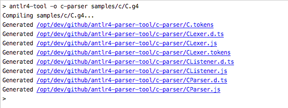

# antlr4-tool

## Overview
The purpose and intent of this project was to create and generate Typescript declaration files
for the [Antlr4](https://www.npmjs.com/package/antlr4) JavaScript target. 
Allowing for generated Antlr Parsers and Lexers that have full **ES5** browser support. This tool also
allows for pure JavaScript implementations, if needed.

## Requirements
* Java Runtime Environment 1.6+ (1.8+ recommended)


## Getting Stated

* Install *antlr4-tool*,  adding it to your package.json

```bash
npm install --save-dev antlr4-tool
```

* Install the Antlr4 library

```bash
npm install -S antlr4
```

* Add a grammar to your project, e.g. path/to/Grammar.g4

```json
"scripts": {
  "generateParser": "antlr4-tool -o parser path/to/Grammar.g4",
  "install-types": "antlr4-types-install"
}
```
**(TypeScript Only) The install-types script is a hack until the DefinitelyTyped Pull Request is approved
(@types/antlr4 Awaiting Pull Request https://github.com/DefinitelyTyped/DefinitelyTyped/pull/27120)**

* Run the NPM script command
```bash
npm run generateParser

#
# Install types into node_modules/@types/antlr4
#
npm run install-types
```

* Use your generated Parser

**JavaScript**
```javascript

const antlr4 = require('antlr4')
const InputStream = antlr4.InputStream;
const CommonTokenStream = antlr4.CommonTokenStream;

const GrammarParser = require('./parser/GrammarParser').GrammarParser;
const GrammarLexer = require('./parser/GrammarLexer').GrammarLexer;

const inputStream = new InputStream('int x = 10;');
const lexer = new GrammarLexer(inputStream);
const tokenStream = new CommonTokenStream(lexer);
const parser = new GrammarParser(tokenStream);

// Parse the input, where `compilationUnit` is whatever entry point you defined
const tree = parser.compilationUnit();
console.log(tree);
```

**TypeScript**
```typescript
import {InputStream, CommonTokenStream} from 'antlr4';
import {GrammarParser} from './parser/GrammarParser';
import {GrammarLexer} from './parser/GrammarLexer';

const inputStream = new InputStream('enter you grammar here');
const lexer = new GrammarLexer(inputStream);
const tokenStream = new CommonTokenStream(lexer);
const parser = new GrammarParser(tokenStream);

// Parse the input, where `compilationUnit` is whatever entry point you defined
const tree = parser.compilationUnit();
console.log(tree);
```

### TypeScript Notes
Add to your **tsconfig.json**:
```
"typeRoots": ["types"],
```


## For Command-Line Use

### Installation For Command-Line Use
```bash
npm install -g antlr4-tool
```

```
  Usage: antlr4-tool [options] <grammars...>

  Options:

    -o --output-dir [output_dir]  Output Directory
    -l --language [language]      Language (Default: TypeScript)
    -h, --help                    output usage information
```


### Example Creating a C Parser for TypeScript & JavaScript
```bash
antlr4-tool -o c-parser samples/c/C.g4
```




## Using antlr4-tool as a Library
```javascript
const tool = require('antlr4-tool');

const opts = {
   language: 'TypeScript', // Only support for JavaScript & TypeScript
   grammarFiles:  ['samples/c/C.g4'],
   outputDirectory: 'c-parser'
};

const compiledResults = tool.compile(opts);

console.log(compiledResults);
```

